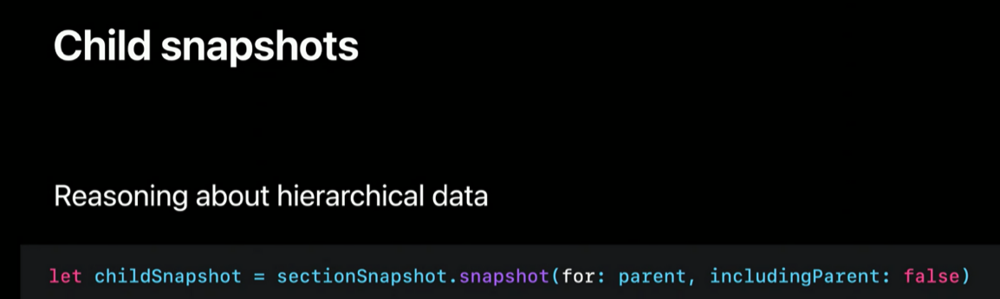
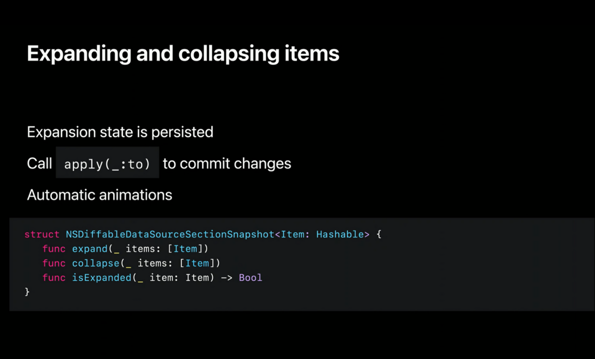
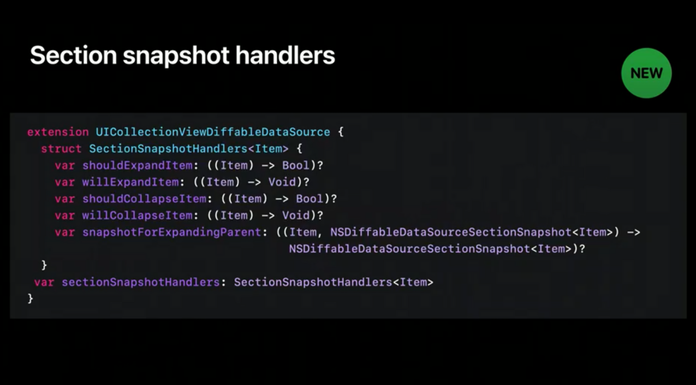

# Advances in diffable data sources


### iOS 13 Advances in UIDataSources

iOS 13에 도입 된 Diffable Data Source는 새로운 snapshot 데이터 유형을 추가하여 UI 상태 관리를 크게 단순화합니다. **snapshot**은 고유 한 섹션 및 item 식별자를 사용하여 전체 UI 상태를 캡슐화합니다. 따라서 UICollectionView를 업데이트 할 때 먼저 새 snapshot을 생성하고 현재 UI 상태로 채우고 datasource에 적용(**apply**)합니다. 
**Diffable Data Source**는 앱 개발자에게 필요한 추가 작업없이 차이점을 계산하고 자동으로 애니메이션합니다.


### iOS 14에서 SectionSnapshot기능과 Reordering에대해서 새로운 기능이 추가되었습니다.

### Section Snapshot

- Single section's data
- Composable data sources
- Hierachical data

> - 섹션단위를 기준으로 데이터를 캡슐화 할 수 있습니다.
> - outline-style UI 렌더링을 지원하는데 필요한 계층적 데이터 모델링을 허용하기 위해서 입니다.


### iOS 14 - NSDiffableDataSourceSectionSnapshot

```swift
@available(iOS 14.0, tvOS 14.0, *)
public struct NSDiffableDataSourceSectionSnapshot<ItemIdentifierType> where ItemIdentifierType : Hashable {
    public init()
    public init(_ snapshot: NSDiffableDataSourceSectionSnapshot<ItemIdentifierType>)
    public mutating func append(
      _ items: [ItemIdentifierType],
      to parent: ItemIdentifierType? = nil
    )

    public mutating func insert(
      _ items: [ItemIdentifierType],
      before item: ItemIdentifierType
    )

    public mutating func insert(
      _ items: [ItemIdentifierType],
      after item: ItemIdentifierType
    )

    public mutating func delete(_ items: [ItemIdentifierType])
    public mutating func deleteAll()
  
    public mutating func expand(_ items: [ItemIdentifierType])
    public mutating func collapse(_ items: [ItemIdentifierType])

    public mutating func replace(
      childrenOf parent: ItemIdentifierType,
      using snapshot: NSDiffableDataSourceSectionSnapshot<ItemIdentifierType>
    )

    public mutating func insert(
      _ snapshot: NSDiffableDataSourceSectionSnapshot<ItemIdentifierType>,
      before item: (ItemIdentifierType)
    )

    public mutating func insert(
      _ snapshot: NSDiffableDataSourceSectionSnapshot<ItemIdentifierType>,
      after item: (ItemIdentifierType)
    )

    public func isExpanded(_ item: ItemIdentifierType) -> Bool
    public func isVisible(_ item: ItemIdentifierType) -> Bool
    public func contains(_ item: ItemIdentifierType) -> Bool
    public func level(of item: ItemIdentifierType) -> Int
    public func index(of item: ItemIdentifierType) -> Int?
    public func parent(of child: ItemIdentifierType) -> ItemIdentifierType?

  	public func snapshot(
      of parent: ItemIdentifierType,
      includingParent: Bool = false
    ) -> NSDiffableDataSourceSectionSnapshot<ItemIdentifierType>

    public var items: [ItemIdentifierType] { get }
    public var rootItems: [ItemIdentifierType] { get }
    public var visibleItems: [ItemIdentifierType] { get }
    public func visualDescription() -> String
}
```

- iOS 13에 도입된 원래의 snapshot 타입 (**SectionIdentifierType**, **ItemIdentifierType** 가 포함된)과 달리 새로운 iOS 14의 section snapshot의 유형을 살펴보면 제네릭 **Item**타입이라는 것을 알 수 있습니다. **SectionIdentifierType**이 없습니다. **section snapshot**은 본질적으로 그들이 나타내는 섹션을 모릅니다.

- 추가된 **NSDiffableDataSourcesSectionSnapshot** 을 위해 **UICollectionViewDiffableDataSource** 에 두 개의 새로운 API가 추가되었습니다.

```swift
extension UICollectionViewDiffableDataSource<Item, Section> {
  func apply(
    _ snapshot: NSDiffableDataSourceSectionSnapshot<Item>,
    to section: Section,
    animatingDifferences: Bool = true,
    completion: (() -> Void)? = nil
  )
  
  func snapshot(for section: Section) -> NSDiffableDataSourceSectionSnapshot<Item>
}
```


### Outline-style 형식 데이터 셋팅

```swift

enum Category: CaseIterable, CustomStringConvertible {
	case recents, smileys, nature, food, activities, travel, objects, symbols
}

for category in Emoji.Category.allCases where category != .recents {
	let rootItem = Item(title: String(describing: category), hasChildren: true)
	outlineSnapshot.append([rootItem]) /// Root가 될 Item, Category Title
	let outlineItems = category.emojis.map { Item(emoji: $0) }
	outlineSnapshot.append(outlineItems, to: rootItem) /// Parent로 rootItem 을 지정, Category 내부항목
}
```


### Child Snapshots



이 코드 스니펫에서는 선택적으로 결과 section snapshot에 부모를 포함하여 특정 부모 Item과 관련된 모든 자식을 가져올 수 있습니다.


### Expanding and collapsing items



확장 상태는 section snapshot상태의 일부로 관리됩니다. 표시 할 snapshot을 작성할 때 expand/collapse 메소드를 통해 해당 Item의 부모 확장 상태를 설정하여 자식 컨텐츠가 처음에 표시되는지 여부를 쉽게 결정할 수 있습니다.
특정 Item이 확장 또는 축소되는지 `isExpanded(_:)`으로 확인 할 수도 있습니다.
section snapshot의 확장 상태를 변경하면 Diffable Data Source에 실제로 `apply(_:to)` 할 때까지 적용되지 않습니다.

### Section Snapshot Handler



```swift
var dataSource: UICollectionViewDiffableDataSource<Section, Item>!

dataSource.sectionSnapshotHandlers.shouldExpandItem = { (item) -> Bool in
	print("펼쳐짐 직전 :", item.title)
	return true
}
        
dataSource.sectionSnapshotHandlers.shouldCollapseItem = { (item) -> Bool in
	print("접힘 직전:", item.title)
	return true
}
        
dataSource.sectionSnapshotHandlers.willCollapseItem = { (item) in
	print("접힘 직후 :", item.title)
}
        
dataSource.sectionSnapshotHandlers.willExpandItem = { (item) in
	print("펼쳐짐 직후 :", item.title)
}

펼쳐짐 직전 : Optional("Food")
펼쳐짐 직후 : Optional("Food")
접힘 직전: Optional("Food")
접힘 직후 : Optional("Food")
```


### Reordering Support (iOS14)

- **Diffable Data Source**가 가져다 주는 발전 사항 중 하나는 고유 Item 식별자를 사용하여 콜렉션 뷰의 데이터를 모델링하는 기능입니다. 이러한 고유한 Item 식별자를 사용하면 프레임워크가 사용자 상호 작용을 기반으로 애플리케이션을 대신하여 순서 변경을 자동으로 커밋 할 수 있습니다. 그러나 이것은 충분하지 않습니다. 새로운 시각적 순서를 앱의 백업 저장소나 최종적인 소스(source of truth)에 유지할 수 있도록, 사용자가 시작한 재정렬 상호 작용이 발생했음을 앱에 알려야합니다. 그래서 재정렬을 지원하기 위해 Diffable Data Source에는 이제 `reorderingHandlers`라는 새로운 속성이 있습니다.

```swift
extension UICollectionViewDiffableDataSource { 
	struct ReorderingHandlers { 
  	var canReorderItem: ((Item) -> Bool)?
    var willReorder: ((NSDiffableDataSourceTransaction<Section, Item>) -> Void)?
    var didReorder:  ((NSDiffableDataSourceTransaction<Section, Item>) -> Void)?
  }
  
  var reorderingHandlers: ReorderingHandlers
}
```

### Reordering transactions

```swift
@available(iOS 14.0, tvOS 14.0, *)
public struct NSDiffableDataSourceTransaction<SectionIdentifierType, ItemIdentifierType> where SectionIdentifierType : Hashable, ItemIdentifierType : Hashable {
    public var initialSnapshot: NSDiffableDataSourceSnapshot<SectionIdentifierType, ItemIdentifierType> { get }
    public var finalSnapshot: NSDiffableDataSourceSnapshot<SectionIdentifierType, ItemIdentifierType> { get }
    public var difference: CollectionDifference<ItemIdentifierType> { get }
    public var sectionTransactions: [NSDiffableDataSourceSectionTransaction<SectionIdentifierType, ItemIdentifierType>] { get }
}
```

- **initialSnapshot** : 업데이트가 적용되기 전에 Diffable Data Source의 상태입니다.

- **finalSnapshot** : 업데이트가 적용된 후 Diffable Data Source의 상태입니다. 이 snapshot에서 이러한 Item 식별자를 직접 사용하여 앱의 최종적인 소스(source of truth)에 커밋해야 하는 새로운 순서를 결정할 수 있습니다.

- **difference** : Swift 표준 라이브러리 `CollectionDifference` 가 지원됩니다. 앱의 최종적인 소스(source of truth)에 `Array`와 같은 데이터 타입이 있는 경우, 해당 `CollectionDifference`를 직접 적용 할 수 있습니다.

- **sectionTransactions** : 이 재정렬 업데이트와 관련된 모든 섹션에 대한 섹션 별 세부 정보를 제공하는 섹션 트랜잭션 목록이 표시됩니다. 섹션 트랜잭션도 구성은 상당히 비슷합니다. 재정렬 업데이트와 관련된 각 섹션에 대해 하나의 섹션 트랜잭션이 제공됩니다. 먼저, 이 `sectionTransaction`이 적용된 `sectionIdentifier`를 검사 할 수 있습니다. 그리고, 이 섹션의 업데이트와 관련된 `CollectionDifference`와 함께 초기 및 최종 section snapshot을 볼 수 있습니다.

### Updating our source of truth 

```swift
for sectionTransaction in transaction.sectionTransactions {
	let sectionIdentifier = sectionTransaction.sectionIdentifier
  self.backingStore[sectionIdentifier] = sectionTransaction.finalSnapshot.items
}
```

트랜잭션과 함께 제공된 Swift 표준 라이브러리 `CollectionDifference`를 사용하여 새로운 백업 저장소를 만들고 최종적인 소스(source of truth)를 직접 업데이트합니다.