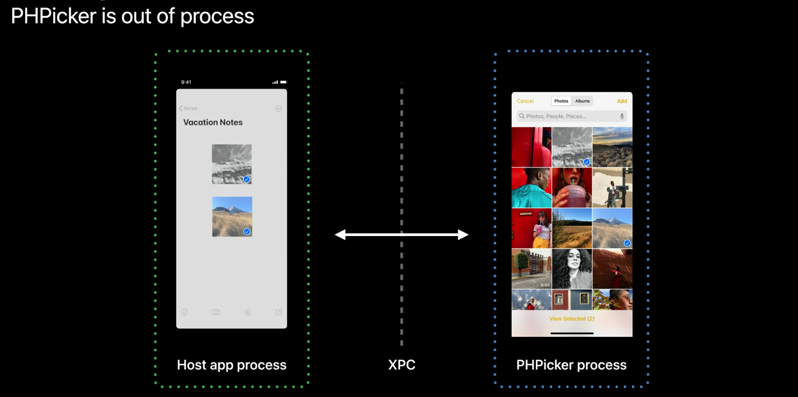
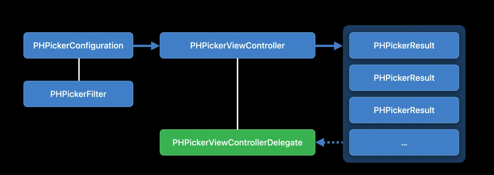
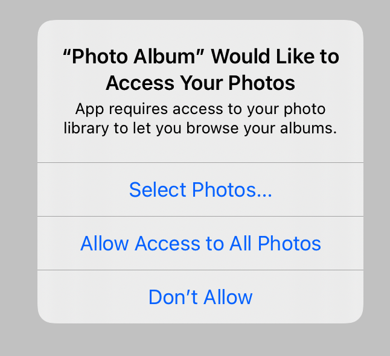
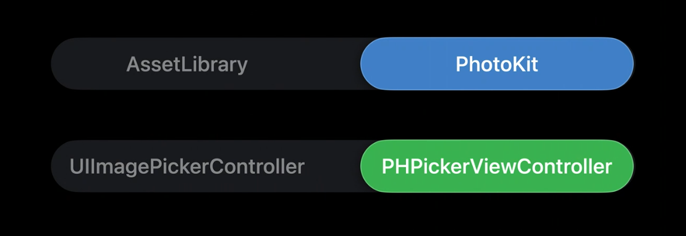

# Meet the new Photos picker

### PHPicker

> ```
> PHPicker는 시스템에서 제공하는 Picker로 사용자 사진 라이브러리에서 사진과 비디오에 접근 할 수 있습니다.
> ```

- photo 와 video에 접근하기위한 가장 좋은 방법
- Photos app 처럼 search 가능
- fluid zooming 
- Multi select 가능
- 새로운 디자인을 제공
- 사용하기 쉬운 새로운 API 
- selectable types를 지정할 수 있음
- privacy측면에서도 좋음

### Privacy by default

- user Photos Library에 직접 접근하지 않아도 됨
- 사진 라이브러리 액세스를 요청하지 않습니다.
- 선택한 사진과 비디오만 제공합니다.(정보 X)

### PHPicker가 앱 내부에서 실행되는 것처럼 보이지만 PHPicker 앱의 프로세스를 벗어납니다.



- 사용자가 실제 선택 한 것만 Host App으로 전달됨

### New API



- optional하게 Multi-select limit, filter 속성을 사용할 수 있다.
- Configuration을 PHPickerController를 생성하고, delegate를 할당해 이벤트 처리할 수 있다. 

### PHPickerConfiguration

- Optional Properties
  - selection limit
  - Item type filtering

```swift
var configuration = PHPickerConfiguration()

/// default is 1, unlimited option is 0
configuration.selectionLimit = 0

/// Only show images
configuration.filter = .images

/// Only Videos or Live Photos
configuration.filter = .any(of: [.videos, .livePhotos])

/// Initialize PickerViewController
let picker = PHPickerViewController(configuration: configuration)

/// set delegate
picker.delegate = self

/// show
present(picker, animated: true)
```

### Handling Result PickerViewControllerDelegate

```swift
func picker(_ picker: PHPickerViewController, didFinishPicking results: [PHPickerResult]) { 
	picker.dismiss()
  
  let itemProvider = results.first.itemProvider
	if let itemProvider = itemProvider, itemProvider.canLoadObject(ofClass: UIImage.self) { 
    itemProvider.loadObject(ofClass: UIImage.self) { image, error in 
			/// use image 
    }
  }
}
```

- ItemProvider API는 비동기로 작동하기 때문에 주의해야함

### Using PHPicker with PhotoKit

- 필요한 경우에만 사진 라이브러리 액세스를 요청하고 사용자가 사진 라이브러리 액세스를 거부하는 경우를 처리하십시오.

```swift
let photoLibrary = PHPhotoLibrary.shared()
let configuration = PHPickerConfiguration(photoLibrary: photoLibrary)
/// In PHPickerViewControllerDelegate
let identifiers = results.compactMap(\.assetIdentifier)
let fetchResult = PHAsset.fetchAssets(withLocalIdentifiers: identifiers, options: nil) 
```

### The new option



- 앱에서 사용자 사진 라이브러리에있는 PHAssets의 일부에만 액세스하도록 허용하는 옵션이 추가됨. 
- 개인 정보를 더 잘 제어 할 수있게됨

### 주의사항

- Picker는 여전히 전체 사진 라이브러리를 표시하며 모든 사진과 비디오는 사용자가 선택할 수 있습니다.
- 사용자가 Picker에서 선택하는 것과 상관없이 접근 할 수있는 PHAsset은 변경되지 않습니다.

### Deprecations

